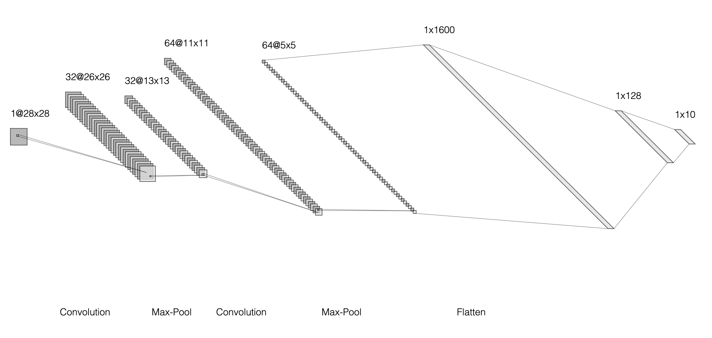
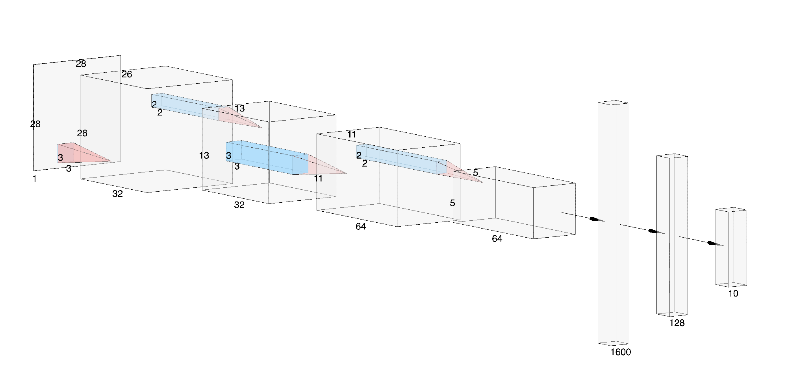

# MNIST Classifier and VAE Visualization Demo

This project was created for a Precision Planting keynote presentation. It is a web-based application that allows users to draw digits and get predictions from a trained MNIST model, as well as visualize the latent space of a Variational Autoencoder (VAE) trained on the MNIST dataset.

## Table of Contents

1. [Setup](#setup)
2. [Introduction to Machine Learning](#introduction-to-machine-learning)
3. [Understanding Neural Networks](#understanding-neural-networks)
4. [Deep Learning and Convolutional Neural Networks (CNNs)](#deep-learning-and-convolutional-neural-networks-cnns)
5. [Convolutional Operations Explained](#convolutional-operations-explained)
6. [Filters and Feature Maps](#filters-and-feature-maps)
7. [Activation Functions](#activation-functions)
8. [Pooling Layers](#pooling-layers)
9. [Fully Connected Layers](#fully-connected-layers)
10. [Model Architecture Overview](#model-architecture-overview)
11. [Training Process](#training-process)
12. [Variational Autoencoders (VAEs)](#variational-autoencoders-vaes)
13. [Latent Space Visualization](#latent-space-visualization)
14. [Conclusion](#conclusion)
15. [Additional Resources](#additional-resources)

---

## Setup
To set up this codebase, follow the steps below:

1. **Clone the Repository**:
   ```bash
   git clone https://github.com/Jtewen/mnist-visual.git
   cd mnist-visual
   ```

2. **Create a Virtual Environment** (optional but recommended):
   ```bash
   python3 -m venv venv
   source venv/bin/activate
   ```

3. **Install Dependencies**:
   Install the required packages using the `requirements.txt` file:
   ```bash
   pip install -r requirements.txt
   ```

4. **Run the Training Script and Start the Flask Application**:
   ```bash
   python3 app.py
   ```

5. **Access the Application**:
   Open your web browser and go to `http://127.0.0.1:5001`

Make sure to have TensorFlow and other dependencies installed as specified in the `requirements.txt` file for the code to run successfully.

---

## Introduction to Machine Learning

**Machine Learning (ML)** is a subset of artificial intelligence that empowers systems to learn and improve from experience without being explicitly programmed. The core objective of ML is to develop algorithms that can identify patterns in data and make decisions or predictions based on those patterns.

### Key Concepts in Machine Learning

- **Data**: The foundation of ML; it includes features (input variables) and labels (output variables).
- **Algorithms**: Procedures or formulas for solving problems, such as classification or regression.
- **Model**: The output of an ML algorithm trained on data, capable of making predictions.

### Types of Machine Learning

1. **Supervised Learning**: The model is trained on labeled data. Examples include classification and regression tasks.
2. **Unsupervised Learning**: The model identifies patterns in unlabeled data. Examples include clustering and dimensionality reduction.
3. **Reinforcement Learning**: The model learns by interacting with an environment to maximize cumulative rewards.

---

## Understanding Neural Networks

A **Neural Network** is a series of algorithms that attempt to recognize underlying relationships in a set of data through a process that mimics the way the human brain operates. It consists of interconnected layers of nodes (neurons).

### Components of a Neural Network

- **Neurons**: Basic units that receive input, process it, and pass the output to the next layer.
- **Layers**:
  - **Input Layer**: Receives the initial data.
  - **Hidden Layers**: Perform computations and feature extraction.
  - **Output Layer**: Provides the final prediction or classification.

### How Neural Networks Learn

Neural networks learn through a process called **backpropagation**, where they adjust the weights of connections based on the error in predictions. This iterative process minimizes the difference between predicted and actual values.

---

## Deep Learning and Convolutional Neural Networks (CNNs)

**Deep Learning** is a subset of machine learning that uses neural networks with many layers (hence "deep") to model complex patterns in data. **Convolutional Neural Networks (CNNs)** are a specialized type of neural network designed for processing structured grid data like images.

### Why CNNs for Image Processing?

CNNs are particularly effective for image-related tasks due to their ability to automatically and adaptively learn spatial hierarchies of features from input images. This reduces the need for manual feature extraction, making them highly efficient for tasks like image classification, object detection, and more.

---

## Convolutional Operations Explained

At the heart of CNNs lies the **convolution operation**, a mathematical process that combines two functions to produce a third function. In the context of CNNs, convolution is used to extract features from input data.

### What is Convolution?

Convolution involves sliding a smaller matrix, known as a **filter** or **kernel**, over the input data to produce a **feature map**. This operation highlights specific features such as edges, textures, or patterns within the data.

### Analogy to Understand Convolution

Imagine you have a stencil (the filter) with a specific pattern. Placing the stencil over different parts of an image and tracing through it can highlight areas of the image that match the stencil's pattern. This process is akin to how convolution filters detect patterns in data.

---

## Filters and Feature Maps

**Filters** are small matrices used in the convolution operation to detect specific features within the input data. Each filter is designed to capture different aspects of the input, such as edges, gradients, or textures.

### How Filters Work

1. **Initialization**: Filters are initialized with random values.
2. **Training**: During training, filters learn to detect specific features by adjusting their weights based on the data.
3. **Application**: Filters are applied to the input data through convolution to produce feature maps.

### Feature Maps

A **feature map** is the output generated by applying a filter to the input data. It represents the presence and strength of a particular feature in different regions of the input.

### Importance of Multiple Filters

Using multiple filters allows the network to detect a variety of features at different levels of abstraction. Early layers might detect simple features like edges, while deeper layers can identify more complex patterns like shapes or objects.

---

## Activation Functions

**Activation functions** introduce non-linearity into the neural network, enabling it to learn and model complex relationships in data. Without activation functions, the network would be limited to linear transformations, severely restricting its learning capabilities.

### Common Activation Functions

1. **ReLU (Rectified Linear Unit)**:
   - **Formula**: `f(x) = max(0, x)`
   - **Advantages**: Introduces non-linearity, mitigates vanishing gradient problem, computationally efficient.
   
2. **Sigmoid**:
   - **Formula**: `f(x) = 1 / (1 + e^(-x))`
   - **Advantages**: Outputs values between 0 and 1, useful for binary classification.
   - **Disadvantages**: Susceptible to vanishing gradients.
   
3. **Tanh (Hyperbolic Tangent)**:
   - **Formula**: `f(x) = tanh(x) = (2 / (1 + e^(-2x))) - 1`
   - **Advantages**: Outputs values between -1 and 1, zero-centered.
   - **Disadvantages**: Also suffers from vanishing gradients.

### Why ReLU?

ReLU is widely used due to its simplicity and effectiveness. It allows models to converge faster and mitigates the vanishing gradient problem, making it ideal for deep networks.

---

## Pooling Layers

**Pooling layers** are used to reduce the spatial dimensions of feature maps, thereby decreasing the number of parameters and computations in the network. They also help in making the representations approximately invariant to small translations in the input.

### Types of Pooling

1. **Max Pooling**:
   - Selects the maximum value within a pooling window.
   - Emphasizes strong features and ignores weaker ones.
   
2. **Average Pooling**:
   - Computes the average value within a pooling window.
   - Provides a smoother output by considering all values.
   
3. **Global Pooling**:
   - Reduces each feature map to a single value by applying pooling over the entire spatial dimensions.

### Example of Max Pooling

Consider a 2x2 max pooling operation on a feature map:
```
Input Feature Map:
[[1, 3, 2, 4],
 [5, 6, 7, 8],
 [9, 10, 11, 12],
 [13, 14, 15, 16]]

After 2x2 Max Pooling:
[[6, 8],
 [14, 16]]
```

Max pooling highlights the most prominent features, enhancing the network's ability to detect significant patterns.

---

## Fully Connected Layers

After a series of convolutional and pooling layers, the network typically includes one or more **fully connected layers**. These layers perform high-level reasoning and interpretation based on the features extracted by previous layers.

### Functionality

- **Flattening**: Converts the 2D feature maps into a 1D feature vector.
- **Dense Connections**: Each neuron in the fully connected layer is connected to every neuron in the previous layer, allowing the network to combine features in complex ways.
- **Output Layer**: The final fully connected layer outputs predictions, such as class probabilities in classification tasks.

### Why Fully Connected Layers?

Fully connected layers integrate the localized information gathered by convolutional layers across the entire input, enabling the network to recognize global patterns and make accurate predictions.

---

## Model Architecture Overview

Understanding the architecture of a CNN is crucial for leveraging its capabilities effectively. Below is a detailed breakdown of the MNIST model architecture used in this project.

### MNIST Model Architecture

1. **Input Layer**:
   - **Shape**: (28, 28)
   - **Function**: Receives the input images in grayscale.

2. **Reshape Layer**:
   - **Shape**: (28, 28, 1)
   - **Function**: Adds a single channel dimension to the input, transforming it into a 3D tensor suitable for convolutional layers.

3. **First Convolutional Layer**:
   - **Filters**: 8
   - **Kernel Size**: 3x3
   - **Activation**: ReLU
   - **Function**: Extracts low-level features such as edges and textures from the input images.

4. **First Max Pooling Layer**:
   - **Pool Size**: 2x2
   - **Function**: Reduces the spatial dimensions of the feature maps, retaining the most significant features.

5. **Second Convolutional Layer**:
   - **Filters**: 16
   - **Kernel Size**: 3x3
   - **Activation**: ReLU
   - **Function**: Extracts higher-level features by building upon the features learned in the first convolutional layer.

6. **Second Max Pooling Layer**:
   - **Pool Size**: 2x2
   - **Function**: Further reduces the spatial dimensions, abstracting the feature representation.

7. **Flatten Layer**:
   - **Function**: Converts the 2D feature maps into a 1D feature vector, preparing it for the dense layers.

8. **Fully Connected (Dense) Layer**:
   - **Units**: 128
   - **Activation**: ReLU
   - **Function**: Introduces non-linearity and enables the network to learn complex patterns.

9. **Output Layer**:
   - **Units**: 10 (one for each digit class)
   - **Activation**: Softmax
   - **Function**: Outputs a probability distribution over the classes, indicating the likelihood of each class being the correct prediction.

### Model Compilation

- **Optimizer**: Adam
  - **Function**: Optimizes the learning process by adjusting the network's weights based on the gradients of the loss function.
  
- **Loss Function**: Sparse Categorical Cross-Entropy
  - **Function**: Measures the difference between the predicted probability distribution and the actual distribution, guiding the optimization process.

- **Metrics**: Accuracy
  - **Function**: Tracks the proportion of correctly predicted instances during training and evaluation.

### Visual Representation




---

## Training Process

Training a CNN involves several steps to ensure that the model accurately learns to classify input data. Here's a comprehensive overview of the training process for the MNIST model.

### 1. Data Preparation

- **Dataset**: MNIST (Modified National Institute of Standards and Technology) dataset.
- **Components**:
  - **Training Set**: 60,000 images.
  - **Test Set**: 10,000 images.
- **Preprocessing**:
  - **Normalization**: Scaling pixel values from [0, 255] to [0, 1] to facilitate faster and more stable training.
  - **Reshaping**: Adding a channel dimension to the input data to match the expected input shape of the CNN.

### 2. Model Initialization

- **Building the Model**: Defining the architecture as described in the [Model Architecture Overview](#model-architecture-overview) section.
- **Weight Initialization**: Weights are initialized randomly, allowing the model to start learning from varying positions in the weight space.

### 3. Compilation

- **Optimizer Selection**: Adam optimizer is chosen for its efficiency and adaptability.
- **Loss Function Selection**: Sparse Categorical Cross-Entropy is appropriate for multi-class classification tasks with integer labels.
- **Metrics Tracking**: Accuracy is monitored to evaluate the model's performance during training.

### 4. Training the Model

- **Epochs**: The number of times the entire training dataset is passed through the model. In this project, the default is set to 10 epochs.
- **Batch Size**: The number of samples processed before the model's internal parameters are updated. A batch size of 128 is used.
- **Validation**: The model's performance is evaluated on the test set after each epoch to monitor overfitting and generalization.

### 5. Saving the Model

- After training, the model's weights are saved to a file (`mnist_model.h5`) to allow for future loading and inference without retraining.


*Note: Ensure that the `MNISTModel` class is properly defined and includes methods for building, training, and evaluating the model as discussed.*

---

## Variational Autoencoders (VAEs)

While Convolutional Neural Networks are excellent for classification tasks, **Variational Autoencoders (VAEs)** are powerful generative models capable of learning complex data distributions and generating new data samples.

### What is a VAE?

A VAE is a type of autoencoder that learns to encode input data into a latent space and decode it back to the original space. Unlike traditional autoencoders, VAEs impose a probabilistic structure on the latent space, enabling them to generate new data points by sampling from this space.

### Components of a VAE

1. **Encoder**:
   - Encodes the input data into a distribution in the latent space.
   - Outputs parameters (mean and log variance) defining the latent distribution.
   
2. **Reparameterization Trick**:
   - Allows the model to backpropagate gradients through stochastic processes by expressing the latent variable as a deterministic function of its parameters and random noise.
   
3. **Decoder**:
   - Decodes samples from the latent space back into the original data space.
   - Learns to reconstruct the input data from the latent representations.

### VAE Architecture

1. **Encoder**:
   - **Input**: Data point.
   - **Layers**: Series of convolutional and dense layers extracting features.
   - **Output**: Mean (\( \mu \)) and log variance (\( \log \sigma^2 \)) of the latent distribution.
   
2. **Latent Space**:
   - **Dimensionality**: Determines the capacity of the model to capture data variations. In this project, a 2-dimensional latent space is used for visualization purposes.
   - **Sampling**: Generates latent vectors by sampling from the learned distribution using the reparameterization trick.
   
3. **Decoder**:
   - **Input**: Latent vector.
   - **Layers**: Series of dense and convolutional transpose layers reconstructing the original data.
   - **Output**: Reconstructed data point.

### Loss Function

VAEs optimize a **combined loss function** comprising:

1. **Reconstruction Loss**:
   - Measures how well the decoder reconstructs the input data from the latent representation.
   - Often implemented as binary cross-entropy or mean squared error.

2. **Kullback-Leibler (KL) Divergence**:
   - Measures the difference between the learned latent distribution and a prior distribution (usually Gaussian).
   - Encourages the latent space to follow a known distribution, facilitating smooth interpolation and data generation.

### Training VAEs

Training involves minimizing the combined loss function to ensure accurate data reconstruction while maintaining a well-structured latent space. This balance allows VAEs to generate new, coherent data samples by sampling from the latent space.

---

## Latent Space Visualization

Understanding the latent space is crucial for interpreting how the VAE represents data internally. Visualizing the latent space provides insights into data distribution, class separability, and the generative capabilities of the model.

### What is Latent Space?

The **latent space** is a lower-dimensional representation of the input data learned by the encoder. Each point in this space corresponds to a compressed version of the input data, capturing essential features and variations.

### Why Visualize Latent Space?

1. **Interpreting Data Structure**: Reveals how different classes or features are organized and related in the latent space.
2. **Generating New Data**: Allows sampling from the latent space to create new, unseen data points.
3. **Understanding Model Behavior**: Helps in diagnosing issues like overfitting or underfitting by observing the distribution of data points.

### Techniques for Visualization

1. **2D Latent Space**:
   - When the latent dimension is set to 2, it's possible to create scatter plots representing each data point in the latent space.
   - Enables easy visualization of clustering, class separation, and distribution.

2. **Interpolation**:
   - Smoothly transitioning between two points in the latent space to generate intermediate data points.
   - Showcases the model's ability to generate coherent and continuous variations of data.

3. **Class Regions**:
   - Coloring regions of the latent space based on the most probable class.
   - Highlights how the model distinguishes between different classes within the latent space.

### Example Visualization Workflow

1. **Encode Data**:
   - Pass input data through the encoder to obtain latent representations (\( \mu \) and \( \sigma^2 \)).

2. **Sampling**:
   - Apply the reparameterization trick to sample points from the latent distribution.

3. **Plotting**:
   - Create a scatter plot where each point represents a data sample in the latent space, colored by its class label.

4. **Overlay Class Regions**:
   - Divide the latent space into regions corresponding to different classes based on the model's predictions.


---

## License

This project is licensed under the MIT License.